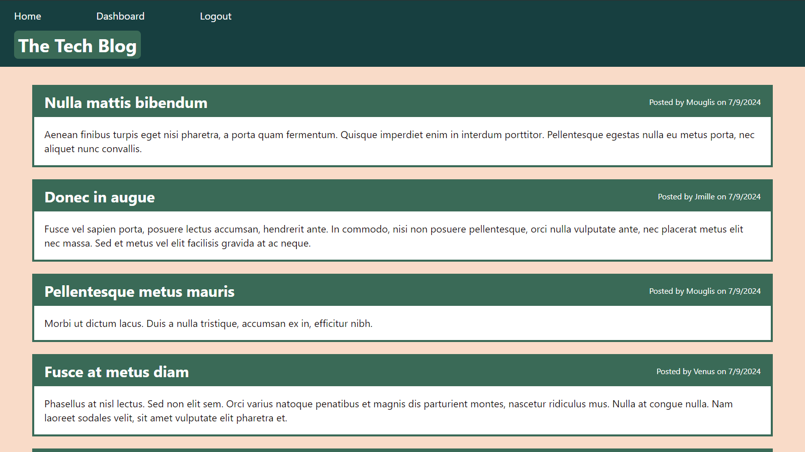

# Tech-Blog

## Description

This is a blog for discussion centered around technology. Sharing ideas, opinions, technical concepts, and tutorials is exceedingly important for advancing tech. This blog allows you to post your thoughts for others to read and respond to with their own comments.

## Table of Contents

- [Tech-Blog](#tech-blog)
  - [Description](#description)
  - [Table of Contents](#table-of-contents)
  - [Usage](#usage)
  - [License](#license)
  - [Contributing](#contributing)
  - [Questions](#questions)

## Usage

Simply visit the site [here](https://tech-blog-ur5q.onrender.com/).

To view any pages beyond the homepage you must log in. Then you will be taken to your dashboard where you can create new posts or click on your previous posts to edit or delete them. Going back to the homepage, you can click on any post to view the comments and click the button at the bottom to open a form to add your own comment.

## License

This application is covered under the [GNU GPLv3](https://choosealicense.com/licenses/gpl-3.0/) license.

## Contributing

If you would like to contribute to this project you may create a fork on GitHub and submit a pull request with your changes.

## Questions

You can find my other projects on [GitHub](https://github.com/JohnKihm).

For additional questions you can reach me at [john.a.kihm@gmail.com](mailto:john.a.kihm@gmail.com).